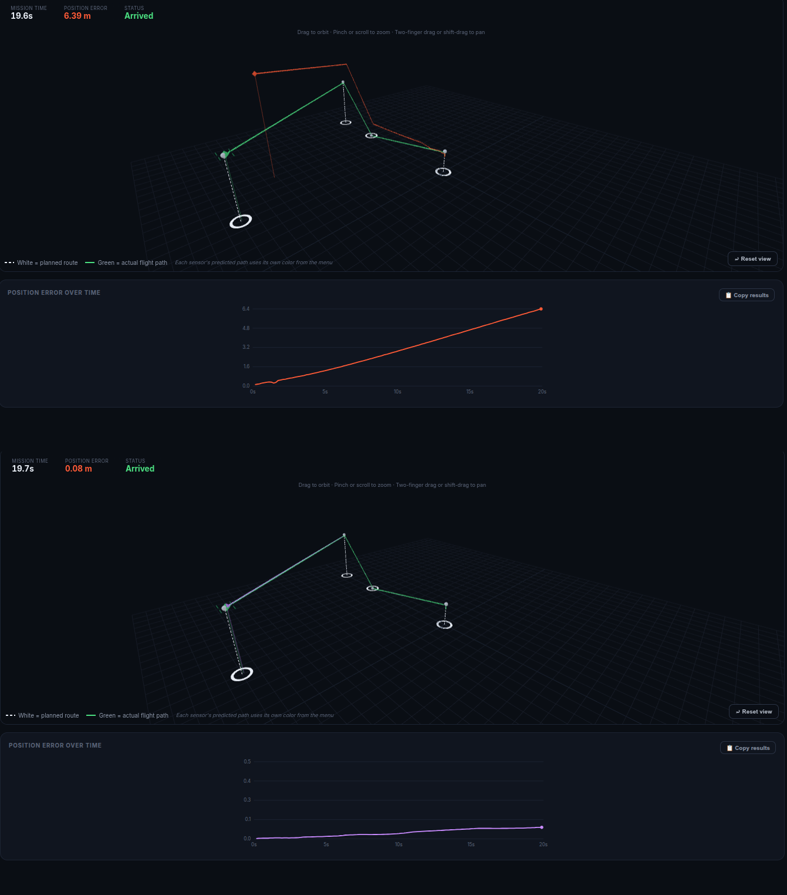

# Quantum INS Drift Simulation

Interactive 3D dead-reckoning simulation comparing classical and quantum-enabled inertial sensors under GNSS-denied conditions — companion code to the paper **"Quantum Sensing Technologies for Inertial Navigation: A State-of-the-Art Review"** (D. Paraschos, N. K. Papadakis, Hellenic Army Academy).

A simulated drone flies a user-defined waypoint route with no GPS. The simulation dead-reckons its position using five different sensor configurations — classical MEMS IMU, cold-atom interferometer, NV-center magnetometer, atom–light hybrid gyroscope, and a proposed MEMS+cold-atom "Hybrid Fusion" architecture — and visualizes how estimation error accumulates over time for each one.



## Live demo

```
npm install
npm run dev
```

Then open the printed local URL (typically `http://localhost:5173`) in your browser.

## What's in this repo

```
.
├── src/
│   ├── App.jsx          # The simulation itself (single React component)
│   └── main.jsx         # Vite/React entry point
├── index.html
├── package.json
├── vite.config.js
├── paper/
│   ├── main.typ         # Full paper source (Typst)
│   ├── References.bib   # Bibliography
│   └── Images/          # Figures referenced by the paper
└── docs/
    └── simulation-methodology.docx   # Full mathematical derivation of the simulation's error model
```

## Running the simulation

Requires [Node.js](https://nodejs.org) (v18+).

```bash
git clone https://github.com/DimitriosParaschos/Q-INS-simulation.git
cd YOUR-REPO-NAME
npm install
npm run dev
```

To build a static production bundle (deployable to GitHub Pages, Netlify, Vercel, etc.):

```bash
npm run build
```

This outputs to `dist/`. To preview the production build locally: `npm run preview`.

## How the simulation works

Each sensor's estimated position diverges from a shared ground-truth flight path through a **first-order Gauss–Markov (Ornstein–Uhlenbeck) bias process** combined with an angle/velocity random-walk term and sample-rate-gated measurement noise — the same noise decomposition used in IEEE Std 952-1997 and standard inertial-navigation textbooks (Groves 2013; Maybeck 1979; Brown & Hwang 2012). The five sensor presets are tuned with relative severity scores (not datasheet values) chosen to reproduce the qualitative drift magnitudes discussed in the paper.

Full derivation of every equation, every constant, and every modeling choice is in:
- **The paper itself**, Section II-E ("Comparative drift simulation")
- **`docs/simulation-methodology.docx`**, a standalone supplementary document with the complete mathematical derivation, a symbol glossary, and explicit statements of the model's limitations

## Building the paper

The paper is written in [Typst](https://typst.app). With Typst installed:

```bash
cd paper
typst compile main.typ
```

**Note:** four figures referenced by the paper (`Images/Bose-steps.svg`, `Images/BEC6.svg`, `Images/BEC7.svg`, `Images/Optical quantum gyro.png`) are not included in this repository and need to be added to `paper/Images/` before the paper will compile. The two simulation-result figures (`mems_vs_nvcenter.png`, `fusion_run.png`) are included.

## Citation

If you use this simulation or the accompanying paper, please cite:

```bibtex
@article{paraschos_papadakis_quantum_ins,
  title   = {Quantum Sensing Technologies for Inertial Navigation: A State-of-the-Art Review},
  author  = {Paraschos, Dimitrios and Papadakis, Nikolaos K.},
  journal = {[journal/venue once published]},
  year    = {2026},
  url     = {https://github.com/DimitriosParaschos/Q-INS-simulation}
}
```
